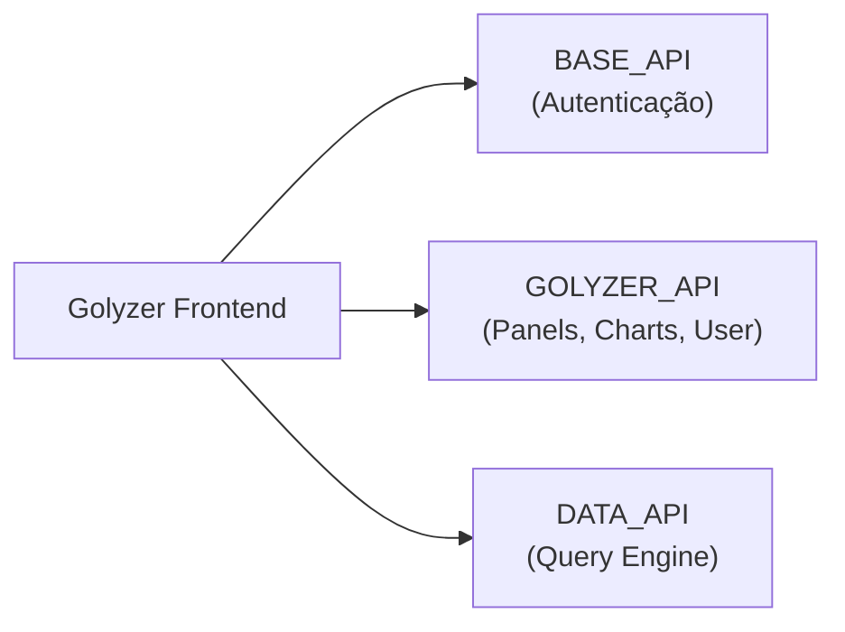

# Mock Backend para Golyzer

## Objetivo

Criar um backend fake standalone que simula todas as APIs consumidas pelo frontend Golyzer, permitindo desenvolvimento e testes sem depender dos serviços reais.

---

## Arquitetura de APIs

O Golyzer consome **3 APIs diferentes**, cada uma com responsabilidades distintas:



### URLs de Ambiente (Referência)

| Variável | URL Original |
|----------|--------------|
| `NEXT_PUBLIC_BASE_API_URL` | `https://edge-api-base-platform.dev.goapice.com` |
| `NEXT_PUBLIC_GOLYZER_API_URL` | `https://edge-api-painel-de-controle.dev.goapice.com` |
| `NEXT_PUBLIC_DATA_API_URL` | `https://api-bi-engine.dev.goapice.com` |

---

## Endpoints a Implementar

### 1. BASE_API - Autenticação

| Método | Endpoint | Descrição | Request Body | Response |
|--------|----------|-----------|--------------|----------|
| `POST` | `/authentication` | Login de usuário | `{ username, password }` | `{ IdToken, AccessToken, RefreshToken }` |
| `GET` | `/authentication/refresh-token/:token` | Renovar token | - | `{ IdToken, AccessToken }` |

---

### 2. GOLYZER_API - Recursos Principais

#### User
| Método | Endpoint | Descrição | Response |
|--------|----------|-----------|----------|
| `GET` | `/me` | Dados do usuário logado | [`UserData`](#userdata) |

#### Panels
| Método | Endpoint | Descrição | Request | Response |
|--------|----------|-----------|---------|----------|
| `GET` | `/panels` | Listar painéis | Query: `{ page, perPage, search }` | [`ApiListPanelData`](#apilistpaneldata) |
| `POST` | `/panels` | Criar painel | [`SavePanelData`](#savepaneldata) | `{ id }` |
| `GET` | `/panels/:id` | Obter painel | - | [`ApiPanelPagesData`](#apipanelpagesdata) |
| `PUT` | `/panels/:id` | Atualizar painel | [`UpdatePanelData`](#updatepaneldata) | `{}` |
| `DELETE` | `/panels/:id` | Deletar painel | - | `{}` |
| `PUT` | `/panels/:id/images` | Upload de imagem | `FormData` | `{}` |

#### Charts
| Método | Endpoint | Descrição | Request | Response |
|--------|----------|-----------|---------|----------|
| `GET` | `/charts/models/custom` | Listar modelos customizados | Query: `{ summary }` | `CustomModel[]` |
| `POST` | `/charts/models/custom` | Salvar modelo | [`SaveCustomChartData`](#savecustomchartdata) | `{ id }` |
| `DELETE` | `/charts/models/custom/:id` | Deletar modelo | - | `{}` |
| `PATCH` | `/charts/models/custom/rename/:id` | Renomear modelo | `{ name }` | `{}` |
| `GET` | `/charts/most-used` | Gráficos mais usados | - | `MostUsedChart[]` |

---

### 3. DATA_API - Query Engine

| Método | Endpoint | Descrição | Request | Response |
|--------|----------|-----------|---------|----------|
| `POST` | `/query/fetch` | Buscar dados do gráfico | [`RequestCreateChartProps`](#requestcreatechartprops) | [`QueryResponse`](#queryresponse) |

#### Headers Customizados Requeridos
```
X-Customer-ID: <uuid>
X-Query-Format: goql
X-App-Name: golyzer
X-Request-ID: <uuid>
X-Builder-Mode: split | unified
X-Span-Attributes: JSON
```

---

## Estruturas de Dados (TypeScript)

### UserData
```typescript
interface UserData {
  id: string;
  username: string;
  email: string;
  name: string;
  customerUuid: string;
  collaboratorUuid: string;
  permissions: string[];
}
```

### ApiCollaborator
```typescript
interface ApiCollaborator {
  id: string;
  name: string;
  email?: string;
}
```

### ApiPanelData
```typescript
interface ApiPanelData {
  id: string;
  name: string;
  owner: ApiCollaborator;
  appearance?: { colors: string[] };
  sharingSummary?: SharingSummary;
  lastUpdate: { date: string; user?: ApiCollaborator };
}
```

### ApiListPanelData
```typescript
interface ApiListPanelData {
  pagination: { total: number; currentPage: number; pageLength: number };
  data: ApiPanelData[];
}
```

### ApiPanelPagesData
```typescript
interface ApiPanelPagesData extends ApiPanelData {
  pages: ApiPage[];
}
```

### ApiPage
```typescript
interface ApiPage {
  id: string;
  name: string;
  items: ApiChart[];
  position: number;
  appearance?: {
    background?: { hex: string };
    format?: string;
    image?: BgImageProps;
    grid?: "lg" | "md" | "sm" | "hidden";
  };
}
```

### SavePanelData
```typescript
type SavePanelData = Omit<ApiPanelData, "id" | "lastUpdate"> & {
  pages: ApiPage[];
};
```

### UpdatePanelData
```typescript
type UpdatePanelData = Omit<ApiPanelData, "lastUpdate"> & {
  pages: ApiPage[];
};
```

### SaveCustomChartData
```typescript
interface SaveCustomChartData {
  name: string;
  appearance: object;
  tags: string[];
  parameters: object;
  driver: "echarts";
}
```

### QueryResponse
```typescript
interface QueryResponse {
  results: Record<string, unknown>[];
  page?: number;
  pages?: number;
  restricted?: boolean;
}
```

---

## Estrutura Sugerida do Projeto

```
golyzer-mock-api/
├── package.json
├── tsconfig.json
├── src/
│   ├── index.ts                 # Entry point
│   ├── server.ts                # Express server setup
│   ├── middleware/
│   │   ├── auth.ts              # JWT validation
│   │   ├── cors.ts              # CORS config
│   │   └── logger.ts            # Request logging
│   ├── routes/
│   │   ├── auth.routes.ts       # /authentication
│   │   ├── user.routes.ts       # /me
│   │   ├── panels.routes.ts     # /panels/*
│   │   ├── charts.routes.ts     # /charts/*
│   │   └── query.routes.ts      # /query/*
│   ├── controllers/
│   │   ├── auth.controller.ts
│   │   ├── user.controller.ts
│   │   ├── panels.controller.ts
│   │   ├── charts.controller.ts
│   │   └── query.controller.ts
│   ├── fixtures/
│   │   ├── users.json
│   │   ├── panels.json
│   │   ├── charts.json
│   │   └── query-results.json
│   └── types/
│       └── index.d.ts           # TypeScript interfaces
└── README.md
```

---

## Exemplo de Implementação

### 1. package.json
```json
{
  "name": "golyzer-mock-api",
  "version": "1.0.0",
  "type": "module",
  "scripts": {
    "dev": "tsx watch src/index.ts",
    "build": "tsc",
    "start": "node dist/index.js"
  },
  "dependencies": {
    "@fastify/cors": "^9.0.1",
    "fastify": "^4.26.0",
    "jsonwebtoken": "^9.0.0",
    "uuid": "^9.0.0"
  },
  "devDependencies": {
    "@types/jsonwebtoken": "^9.0.2",
    "@types/node": "^20.4.2",
    "@types/uuid": "^9.0.2",
    "tsx": "^4.6.0",
    "typescript": "^5.1.6"
  }
}
```

### 2. src/server.ts
```typescript
import Fastify from "fastify";
import cors from "@fastify/cors";
import authRoutes from "./routes/auth.routes";
import userRoutes from "./routes/user.routes";
import panelsRoutes from "./routes/panels.routes";
import chartsRoutes from "./routes/charts.routes";
import queryRoutes from "./routes/query.routes";

const app = Fastify({ logger: true });

await app.register(cors);

// BASE_API routes
await app.register(authRoutes, { prefix: "/authentication" });

// GOLYZER_API routes
await app.register(userRoutes, { prefix: "/me" });
await app.register(panelsRoutes, { prefix: "/panels" });
await app.register(chartsRoutes, { prefix: "/charts" });

// DATA_API routes
await app.register(queryRoutes, { prefix: "/query" });

export default app;
```

### 3. src/routes/auth.routes.ts
```typescript
import { FastifyPluginAsync } from "fastify";
import { v4 as uuid } from "uuid";
import jwt from "jsonwebtoken";

const SECRET = "mock-secret-key";

const authRoutes: FastifyPluginAsync = async (fastify) => {
  fastify.post<{ Body: { username: string; password: string } }>("/", async (request) => {
    const { username } = request.body;
    
    const IdToken = jwt.sign({ username, type: "id" }, SECRET, { expiresIn: "1h" });
    const AccessToken = jwt.sign({ username, type: "access" }, SECRET, { expiresIn: "1h" });
    const RefreshToken = uuid();
    
    return { IdToken, AccessToken, RefreshToken };
  });

  fastify.get<{ Params: { token: string } }>("/refresh-token/:token", async () => {
    const IdToken = jwt.sign({ type: "id" }, SECRET, { expiresIn: "1h" });
    const AccessToken = jwt.sign({ type: "access" }, SECRET, { expiresIn: "1h" });
    
    return { IdToken, AccessToken };
  });
};

export default authRoutes;
```

### 4. src/routes/panels.routes.ts
```typescript
import { FastifyPluginAsync } from "fastify";
import { v4 as uuid } from "uuid";
import panels from "../fixtures/panels.json" with { type: "json" };

let panelsDb = [...panels];

const panelsRoutes: FastifyPluginAsync = async (fastify) => {
  fastify.get<{ Querystring: { page?: string; perPage?: string; search?: string } }>("/", async (request) => {
    const { page = "1", perPage = "10", search = "" } = request.query;
    const filtered = panelsDb.filter(p => 
      p.name.toLowerCase().includes(search.toLowerCase())
    );
    
    return {
      pagination: {
        total: filtered.length,
        currentPage: Number(page),
        pageLength: Number(perPage)
      },
      data: filtered.slice(
        (Number(page) - 1) * Number(perPage), 
        Number(page) * Number(perPage)
      )
    };
  });

  fastify.get<{ Params: { id: string } }>("/:id", async (request, reply) => {
    const panel = panelsDb.find(p => p.id === request.params.id);
    if (!panel) return reply.status(404).send({ error: "Panel not found" });
    return panel;
  });

  fastify.post("/", async (request) => {
    const newPanel = { id: uuid(), ...request.body as object, lastUpdate: { date: new Date().toISOString() } };
    panelsDb.push(newPanel as any);
    return { id: newPanel.id };
  });

  fastify.put<{ Params: { id: string } }>("/:id", async (request, reply) => {
    const index = panelsDb.findIndex(p => p.id === request.params.id);
    if (index === -1) return reply.status(404).send({ error: "Panel not found" });
    panelsDb[index] = { ...panelsDb[index], ...request.body as object };
    return {};
  });

  fastify.delete<{ Params: { id: string } }>("/:id", async (request) => {
    panelsDb = panelsDb.filter(p => p.id !== request.params.id);
    return {};
  });
};

export default panelsRoutes;
```

### 5. src/fixtures/panels.json (Exemplo)
```json
[
  {
    "id": "panel-001",
    "name": "Dashboard de Vendas",
    "owner": { "id": "user-001", "name": "Admin User" },
    "appearance": { "colors": ["#3B82F6", "#10B981", "#F59E0B"] },
    "lastUpdate": { "date": "2026-01-10T10:00:00Z" },
    "pages": [
      {
        "id": "page-001",
        "name": "Visão Geral",
        "position": 0,
        "items": []
      }
    ]
  }
]
```

---

## Configuração no Golyzer

Para usar o mock server, atualize o `.env.local` do Golyzer:

```bash
NEXT_PUBLIC_GOLYZER_API_URL="http://localhost:3001"
NEXT_PUBLIC_BASE_API_URL="http://localhost:3001"
NEXT_PUBLIC_DATA_API_URL="http://localhost:3001"
```

---

## Verificação

### Testes Manuais

1. **Iniciar o mock server**: `pnpm dev`
2. **Testar autenticação**:
   ```bash
   curl -X POST http://localhost:3001/authentication \
     -H "Content-Type: application/json" \
     -d '{"username":"test","password":"test"}'
   ```
3. **Testar listagem de panels**:
   ```bash
   curl http://localhost:3001/panels -H "Authorization: Bearer <token>"
   ```

### Integração com Golyzer
1. Atualizar `.env.local` para apontar para `http://localhost:3001`
2. Iniciar o Golyzer: `yarn dev`
3. Fazer login e verificar se os dados mockados aparecem

---

## Próximos Passos

1. [ ] Criar repositório `golyzer-mock-api`
2. [ ] Implementar estrutura base com Express
3. [ ] Implementar rotas de autenticação
4. [ ] Implementar rotas de painéis
5. [ ] Implementar rotas de gráficos
6. [ ] Implementar rota de query
7. [ ] Criar fixtures com dados realistas
8. [ ] Documentar no README
9. [ ] Testar integração com Golyzer
